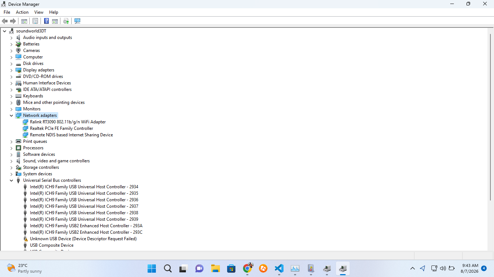

# Lab 04 - Device Manager

## Objective

Explore Device Manager and identify installed hardware devices.

---

## Steps Performed

1. Opened Device Manager.
2. Expanded Network Adapters.
3. Expanded Display Adapters.
4. Expanded Disk Drives.
5. Expanded Bluetooth.
6. Expanded USB Controllers.

---

## Observations

Network Adapter:

Display Adapter:

Disk Drive:

Bluetooth:

Were there any warning icons?

Yes / No

---

## What I Learned

Explain how Device Manager helps IT technicians troubleshoot hardware issues.

---

Completed by Dennis Mathias Franklin

## Evidence

### Screenshot

### Notes

This screenshot shows the Network Adapters section in Device Manager during my lab exercise.