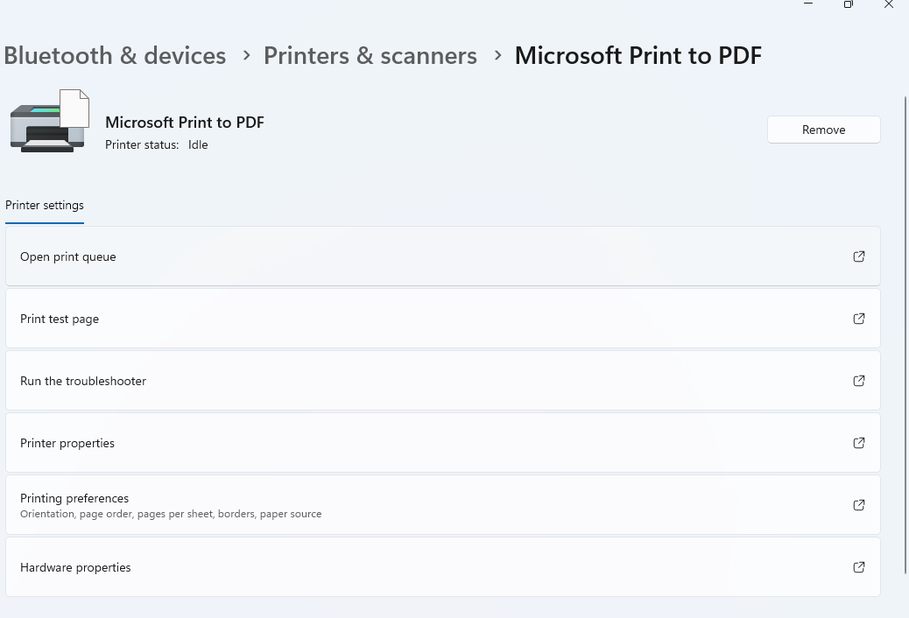

# Lab 05 - Printer Troubleshooting

## Objective

Learn how to diagnose and resolve common printer problems in a Windows environment.

---

## Scenario

A user reports that they cannot print documents to the office printer. Every document remains in the print queue and never prints.

---

## Environment

- Windows 11
- HP LaserJet Printer
- Connected through USB or Network

---

## Tools Used

- Settings
- Control Panel
- Print Queue
- Services
- Command Prompt

---

## Investigation

### Step 1

Opened **Settings > Bluetooth & devices > Printers & scanners**.

Result:

The printer appeared online.

---

### Step 2

Opened the printer queue.

Result:

Several print jobs were stuck.

---

### Step 3

Cancelled all pending print jobs.

Result:

Queue cleared successfully.

---

### Step 4

Restarted the **Print Spooler** service.

Steps:

- Press Win + R
- Type:

```
services.msc
```

- Locate **Print Spooler**
- Click Restart

Result:

Service restarted successfully.

---

### Step 5

Printed a Windows Test Page.

Result:

Printer responded successfully.

---

## Root Cause

The Print Spooler service became stuck because of failed print jobs.

---

## Resolution

- Cleared the print queue
- Restarted Print Spooler
- Printed a successful test page

---

## Verification

User successfully printed multiple documents.

Status:

✅ Resolved

---

## What I Learned

Printer issues are often caused by stuck print jobs or Print Spooler problems rather than hardware failure.

---

Completed by Dennis Mathias Franklin

## Evidence

### Screenshot



### Notes

This screenshot shows the printer settings or print queue during troubleshooting.