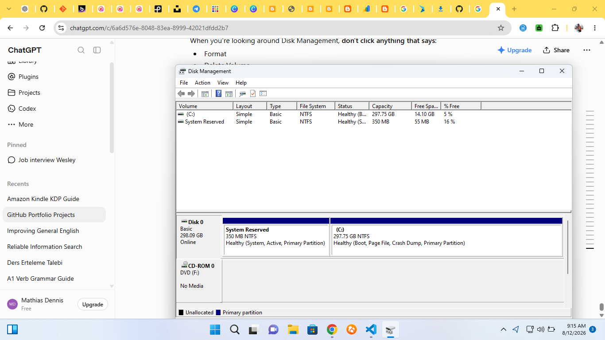

# Lab 08 - Disk Management Investigation

## Objective

Explore Windows Disk Management and identify the storage devices and partitions available on the computer.

---

## Steps Performed

1. Opened Disk Management.
2. Identified the primary disk.
3. Identified the Windows system partition.
4. Reviewed the available partitions.
5. Reviewed drive letters.
6. Checked the status of the available volumes.

---

## Observations

### Primary Disk

Disk Number: Disk 0

Disk Size: 298.09 GB

Disk Status: Online

### Windows Drive

Drive Letter: C:

File System: NTFS

Size: 297.75 GB

Free Space: 14.10 GB

### Other Partitions

List any other partitions you observed.

---

## What I Learned

Disk Management provides information about physical disks, partitions, volumes, and drive letters.

It can help IT Support technicians investigate missing drives and other storage-related problems.

---

## Safety Note

No partitions were deleted, formatted, resized, or otherwise modified during this lab.

---
## What I Observed

- Disk 0 is the primary physical disk.
- The disk has a total capacity of approximately 298 GB.
- The Windows (C:) drive uses the NTFS file system.
- The C: drive has approximately 14.10 GB of free space remaining.
- The System Reserved partition is 350 MB.
- Disk 0 is online and the Windows drive is healthy.

---

## What I Learned

Disk Management is a Windows tool used by IT technicians to view and manage disks, partitions, and volumes. It can help identify storage capacity, available space, partition status, and file systems when troubleshooting storage-related problems.

---

## Evidence

### Screenshot

Screenshot showing Disk Management and the Windows (C:) drive information.

Completed by Dennis Mathias Franklin